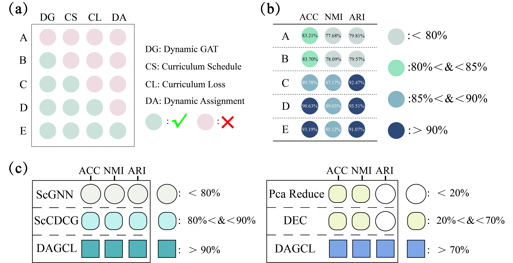

# DAGCL: Dynamic Attention-enhanced Graph Embedding with Curriculum Learning

This is the source code for the paper **“Curriculum-guided divergence scheduling improves single-cell clustering robustness”**.

This repository contains the reference implementation for **DAGCL**, a graph-based deep clustering framework that operationalizes a simple principle for noisy, sparse scRNA-seq data:

> **Clustering pressure should rise only after representations stabilize.**  
> Early training should learn a noise-tolerant manifold. Late training should sharpen partitions.

DAGCL instantiates this principle by synchronizing three quantities during training: representation capacity, divergence-based self-supervision, and assignment balancing.

---

## Core idea: staged clustering as representation maturation

Most deep clustering pipelines apply a fixed architecture and a fixed clustering objective throughout training. DAGCL instead treats clustering as a **coarse-to-fine procedure**.

In DAGCL, training starts from a conservative regime that favors stable embeddings under sparsity and dropout. As training progresses, DAGCL increases the effective capacity and the clustering pressure, so that the model refines boundaries only when the embedding geometry is ready.

---

## Key contributions

1. **Dynamic capacity in graph aggregation**  
   DAGCL uses a dynamic attention mechanism that adapts aggregation strength and effective channel capacity during training, improving separation while avoiding early oversmoothing.

2. **Progress-aware divergence scheduling**  
   DAGCL modulates the KL-based clustering objective according to training progress, reducing early confirmation bias when pseudo-labels are unreliable and strengthening supervision when structure becomes consistent.

3. **Entropy-regularized assignment balancing**  
   DAGCL uses Sinkhorn balancing to regularize soft assignments and improve global consistency, stabilizing optimization under class imbalance and noise.

---

## Figures (quick overview)

### Fig. 1. DAGCL architecture
 summarizes the full pipeline, including dynamic attention, divergence scheduling, and Sinkhorn-balanced assignments.


---

### Fig. 2. Curriculum dynamics and interpretability diagnostics
 visualizes DCL with progress.


---

### Fig. 3. Clustering visualizations
provides representative embedding and clustering visualizations across some datasets.


---

### Fig. 4. Experimental results
 summarizes benchmark results.



---

## Reproducibility: environment

We recommend the following environment for reproducibility.

- Python 3.7  
- PyTorch 1.12 + CUDA 11.3  
- Keras 2.4.3  
- numpy 1.19.5  
- pandas 1.3.5  
- scanpy 1.8.2  
- torch 1.12.0  

Example installation (conda + pip):

```bash
conda create -n dagcl python=3.7 -y
conda activate dagcl

pip install torch==1.12.0 torchvision==0.13.0 torchaudio==0.12.0 --extra-index-url https://download.pytorch.org/whl/cu113
pip install keras==2.4.3 numpy==1.19.5 pandas==1.3.5 scanpy==1.8.2 scipy==1.7.3 scikit-learn==1.0.2 anndata==0.8.0
```

## Data preparation

Place processed datasets under data/. We assume a cells-by-genes matrix in X, and labels for evaluation if available.

## Example structure:
```
data/
  Maayan_Mouse_Pancreas_cell_1.h5
  Human_Pancreas_Cells_2.h5ad
  Meuro_Human_Pancreas_cells.h5ad
  Mouse_Bladder_cells.h5ad
  Worm_Neuron_cells.h5ad
  CITE_CMBC.h5ad
  Human_Liver_cells.h5ad
........
```
## Training

A typical training run:
```
python scripts/train_dagcl.py \
  --data data/Maayan_Mouse_Pancreas_cell_1.h5 \
  --epochs 200 \
  --lr 1e-3 \
  --seed 0
```
## Acknowledgement
This implementation is built on top of a strong and clean baseline framework. Our engineering pipeline and parts of the training structure reference the scCDCG codebase.
bibtex
```
@article{xu2024sccdcg,
  title={scCDCG: Efficient Deep Structural Clustering for single-cell RNA-seq via Deep Cut-informed Graph Embedding},
  author={Xu, Ping and Ning, Zhiyuan and Xiao, Meng and Feng, Guihai and Li, Xin and Zhou, Yuanchun and Wang, Pengfei},
  journal={arXiv preprint arXiv:2404.06167},
  year={2024}
}
```
## Citation 
Thank you for your attention and reference, if you have any other questions, please contact us email: zhoumiehua25@mails.ucas.ac.cn . If you use this codebase in your work, please cite:
bibtex
```
@article{dagcl2026,
  title={Curriculum-guided divergence scheduling improves single-cell clustering robustness},
  author={Zhou, Meihua and others},
  journal={Neural Networks},
  year={2026}
}
```


